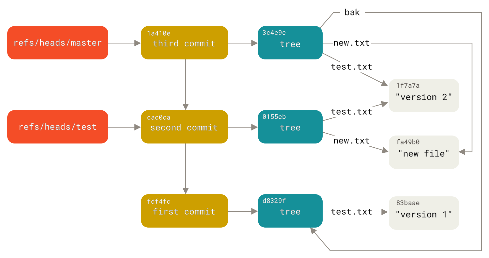

## Trying to understand git...

### Git base data model

[Similarly to Seafile](https://git.deuxfleurs.fr/quentin/seafile_recovery), Git has a ref/commit/tree/blob approach to storing content.
It is summarized by this picture extracted from chapter 10.3 of git internals:

All of these 4 concepts (ref/commit/tree/blob), 3 of them (commit/tree/blob) are content addressed objects.
It means that, before being compressed, we compute their `sha1sum`, and it becomes their object name.
Hence, an object that did not change will keep the same sha1 fingerprint and will not be stored multiple times.

### Git packs

*TODO*

### Wire protocols

*TODO*

## References
 - Git Internals
   - [10.2 Git Internals - Git Objects](https://git-scm.com/book/en/v2/Git-Internals-Git-Objects)
   - [10.3 Git Internals - Git References](https://git-scm.com/book/en/v2/Git-Internals-Git-References)
   - [10.4 Git Internals - Packfiles](https://git-scm.com/book/en/v2/Git-Internals-Packfiles)
   - [10.5 Git Internals - The RefSpec](https://git-scm.com/book/en/v2/Git-Internals-The-Refspec)
   - [10.6 Git Internals - Transfer Protocols](https://git-scm.com/book/en/v2/Git-Internals-Transfer-Protocols)
 - [You can run git on object storage if you re-make packfiles](https://www.tigrisdata.com/blog/objgit-packfiles/)
